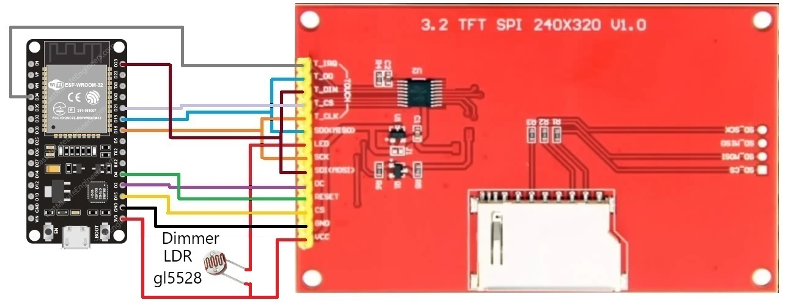

ESP32 & ILI9341 Display Test Sheldon attack v1.0  ManuUniverso 2025

Simple test to connect an ESP32 DevKit V1 Node32s to a TFT Touch ILI9341 display with three alternative images. 
When pressing the display, the images alternate, creating a basic animation to verify functionality.

2025 06
